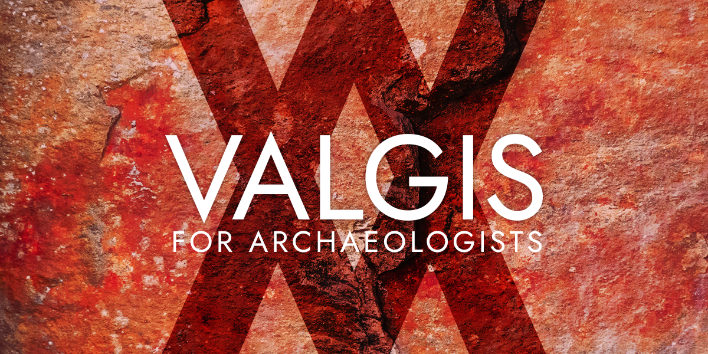
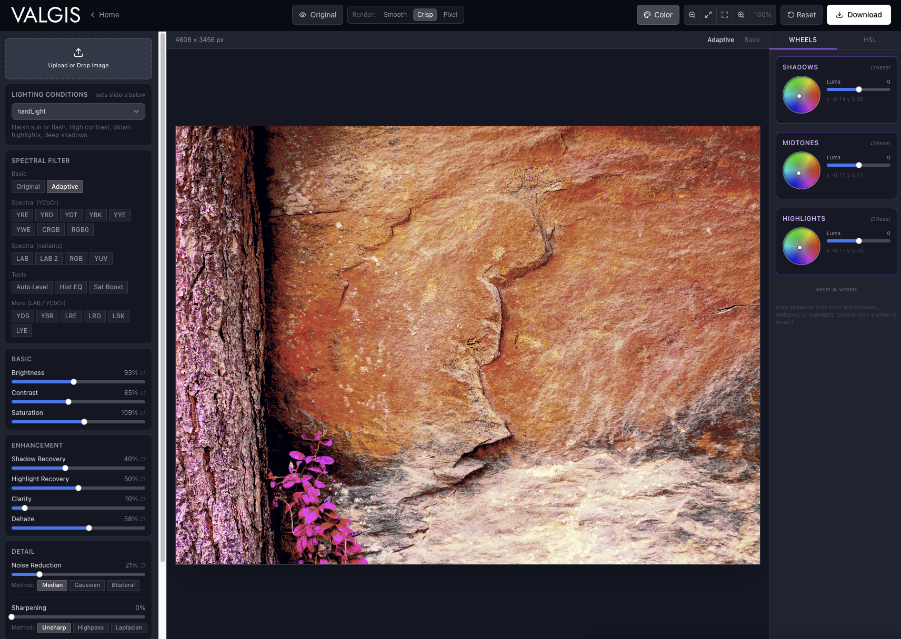

# Valgis

High-performance browser-based spectral imaging suite. Real-time PCA-driven enhancement for rock art, archaeology, cultural heritage, and forensics.

Free for researchers, archaeologists, and students. Open source under AGPL-3.0 — commercial use requires keeping the source open.

---

## Two tools, one workflow

### Desktop Studio

A full editing environment for site photography. Load TIFF, HEIC, RAW, or JPEG. Apply any spectral filter, then refine with shadow and highlight recovery, dehaze, clarity, noise reduction, and sharpening. The same controls you'd reach for in Lightroom, Darktable, or Adobe Camera Raw, built into the same workflow as the spectral filters.

Come back from the site with a folder of DSLR shots. Load them one by one, work through the filter set, pull out what the camera didn't show you.



### Field Camera


A live camera view for on-site scanning. Open on your phone, point at a panel, and the decorrelated image shows in real time. Tap through the filter strip at the bottom. When you see pigment come up, tap to capture. Saves a full-resolution PNG to your camera roll, processed fresh at the camera's native resolution.

Use it to scan quickly across a panel before you commit the DSLR. It tells you where to shoot and which filter to follow up with at home.

---

## Filters

| Filter | Space | Stretch | Best for |
|---|---|---|---|
| YRE | YCbCr | ×2.5 | Haematite, ochre, iron oxide. First filter to try |
| YRD | YCbCr | ×2.0 | Red pigments, balanced |
| YDT | YCbCr | ×1.5 | Subtle darks, minimal clipping |
| YBK | YCbCr | ×1.8 | Charcoal, dark manganese |
| YYE | YCbCr | ×3.5 | Weathered ochre, limonite |
| YWE | YCbCr | ×4.0 | Kaolin, pale calcite wash |
| LRE | LAB | ×2.5 | Red, perceptually balanced, noise-resistant |
| LBK | LAB | ×1.8 | Dark features on cool surfaces |
| LAB | LAB | ×2.2 | Weathered surfaces, good all-round |
| CRGB | RGB | ×3.0 | Fast vivid scan |
| Adaptive | n/a | n/a | Auto-suppresses lichen and shadow |

**Adaptive** is a custom filter unique to Valgis. Instead of a fixed decorrelation matrix, it samples the image locally and suppresses lichen, shadow, and surface variation that would otherwise dominate the stretch.

---

## No install. No account. No upload.

Everything runs in the browser. Nothing leaves your device.

[**→ Open Valgis**](https://thevangelist.github.io/valgis/)

---

## Development

```bash
cd decorrelation-stretch
npm install
npm run dev
```

PCA runs in a Web Worker with temporal EMA smoothing for live camera stability. Built with React, Vite, Tailwind, and [ml-matrix](https://github.com/mljs/matrix).
