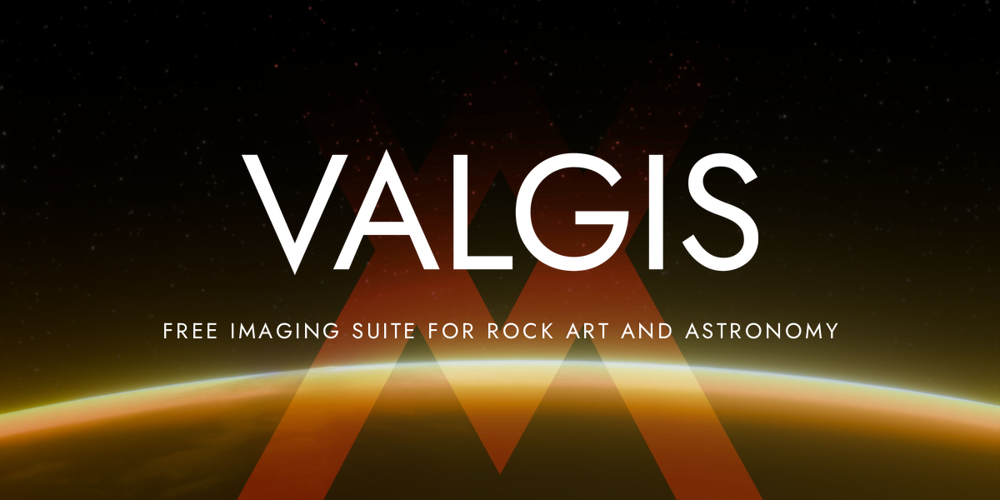
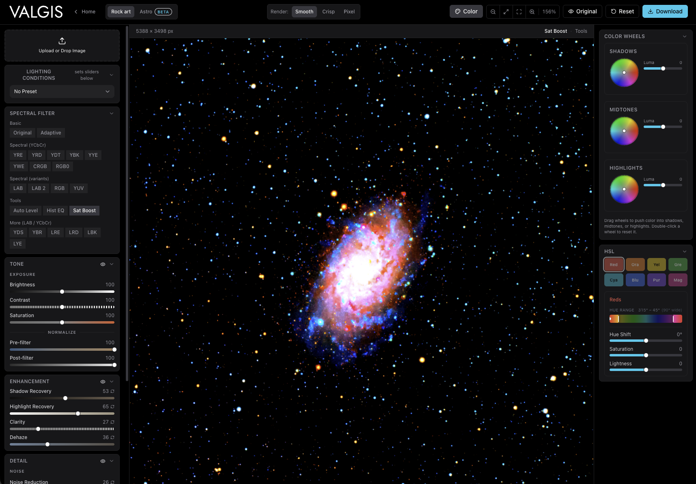

# Valgis

Browser-based spectral imaging. PCA decorrelation stretch for rock art and archaeology, linear-data stretching for astrophotography. Nothing is reconstructed: every tool is measured signal, amplified.

Free for researchers, archaeologists, and students. Open source under AGPL-3.0. Commercial use requires keeping the source open.

---

## Two tools, one workflow

### Studio

A desktop editor with two modes.

**Rock art.** Load TIFF, HEIC, RAW, or JPEG. Apply a spectral filter, then refine with shadow and highlight recovery, dehaze, clarity, noise reduction, and sharpening. Come back from the site with a folder of DSLR shots, work through the filter set, pull out what the camera didn't show you.

**Astro (beta).** Load a FITS frame or a 16-bit TIFF at full precision. Auto-STF, asinh, and log stretches on linear data, linked or per channel. Background extraction, background neutralization, 2×2 binning, SCNR. Then the same tone and detail tools as Rock art, for a single underexposed frame as much as a stack.



### Field Camera


A real-time camera view for on-site scanning. Open on your phone, point at a panel, and the decorrelated image updates live as you move. Tap through the filter strip at the bottom. When you see pigment come up, tap to capture. Saves a full-resolution PNG to your camera roll, processed fresh at the camera's native resolution.

Use it to scan quickly across a panel before you commit the DSLR. It tells you where to shoot and which filter to follow up with at home.

---

## Filters

| Filter | Space | Stretch | Best for |
|---|---|---|---|
| YRE | YCbCr | ×2.5 | Haematite, ochre, iron oxide. First filter to try |
| YRD | YCbCr | ×2.0 | Red pigments, balanced |
| YDT | YCbCr | ×1.5 | Subtle darks, minimal clipping |
| YBK | YCbCr | ×1.8 | Charcoal, dark manganese |
| YYE | YCbCr | ×3.5 | Weathered ochre, limonite |
| YWE | YCbCr | ×4.0 | Kaolin, pale calcite wash |
| LRE | LAB | ×2.5 | Red, perceptually balanced, noise-resistant |
| LBK | LAB | ×1.8 | Dark features on cool surfaces |
| LAB | LAB | ×2.2 | Weathered surfaces, good all-round |
| CRGB | RGB | ×3.0 | Fast vivid scan |
| Adaptive | n/a | n/a | Auto-suppresses lichen and shadow |

**Adaptive** is not a PCA filter. It is a per-pixel heuristic: pixels with a green cast get their green channel cut, dark pixels get a warm lift, everything else a mild red bias. It is a quick lichen and shadow suppressor, not a locally sampled stretch.

---

## No install. No account. No upload.

Everything runs in the browser. Nothing leaves your device. No AI, no deconvolution, no guessing: if it is in the output, it was in the sensor data.

[**→ Open Valgis**](https://thevangelist.github.io/valgis/)

---

## Development

```bash
npm install
npm run dev
```

```bash
npm test        # vitest
npm run typecheck
```

PCA and the tonal chain run in a Web Worker, with temporal EMA smoothing for live camera stability. Built with React, Vite, Tailwind, and [ml-matrix](https://github.com/mljs/matrix).
